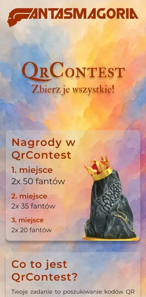
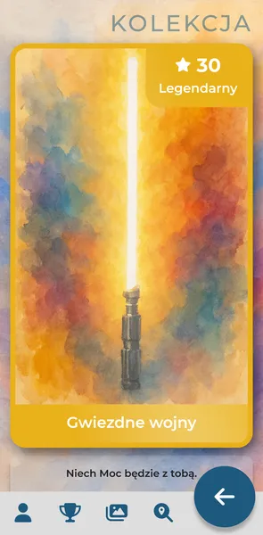
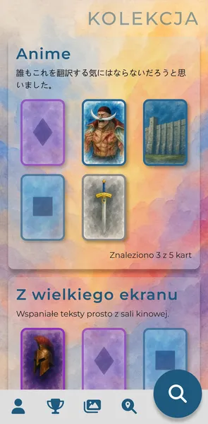
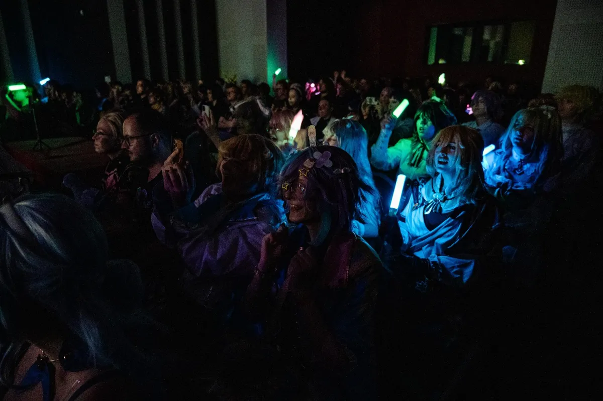
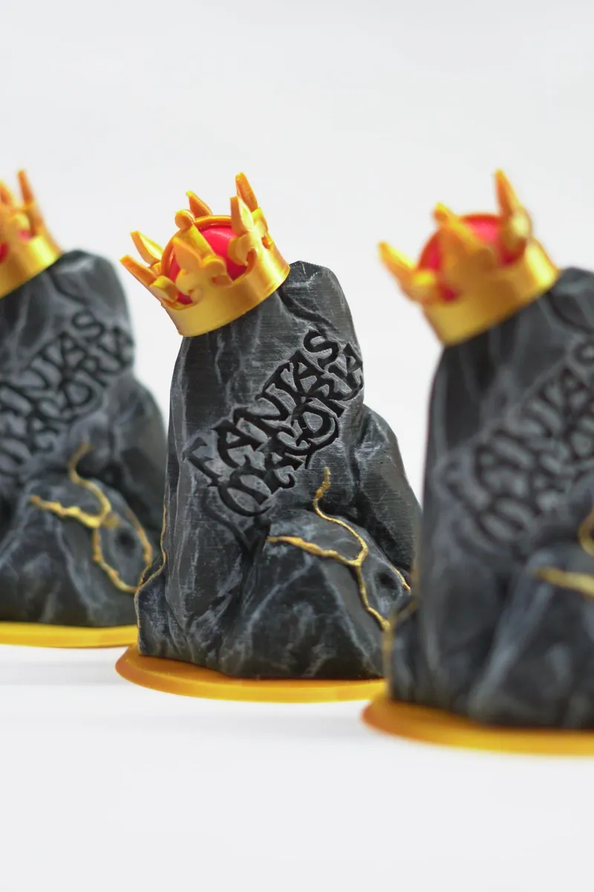
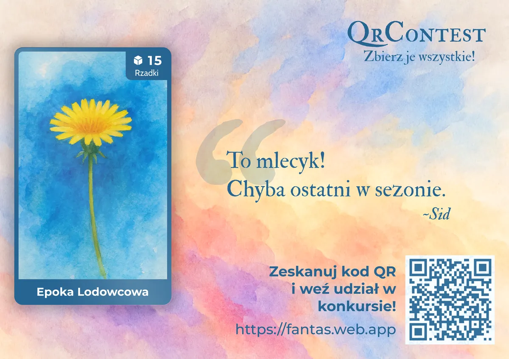

# QrContest

A game made for people who come together once a year to escape routine.  
Built by a volunteer, played by strangers, remembered by everyone who took part.

<table>
  <tr>
    <td></td>
    <td></td>
    <td></td>
  </tr>
</table>

## Overview
QrContest is a mobile web app used during the **Fantasmagoria** fantasy convention in Gniezno, Poland.  
It turns the entire convention area into a giant scavenger hunt.  
Over 150 participants search for hidden QR cards, scan them, collect digital cards, answer questions, and climb the leaderboard.  
Every year brings new lore, new art, and new cards to find.

Fantasmagoria is a non-profit event made by people who simply enjoy creating fun for others.  
QrContest exists because of that spirit - no sponsors, no budget, no monetization.  

| Year | Edition            | Stack                                                  |
|------|--------------------|--------------------------------------------------------|
| 2025 | 15th Fantasmagoria | Next.js / React / TS / Firestore / Firebase / Tailwind |
| 2024 | 14th Fantasmagoria | Next.js / React / TS / Firestore / Firebase / Tailwind |
| 2023 | 13th Fantasmagoria | Next.js / React / TS / Firestore / Firebase / Tailwind |
| 2022 | 12th Fantasmagoria | PHP / Laravel / MySQL / React / Mantine                |
| 2018 | ZSEO High School   | PHP / MySQL / React / Bootstrap                        |
| 2017 | ZSEO High School   | PHP / MySQL / Bootstrap                                |

## Motivation
QrContest started as an experiment in high school - few PHP scripts and Bootstrap pages for a “Day of IT” event.  
It was inspired by a game I saw at a student IT festival in Kraków in 2016. 
Simple idea, instant success. People ran through school hallways scanning codes, shouting hints, laughing. 
It worked because it gave them something fun to do together.

Years later, while organizing Fantasmagoria, I decided to rebuild it.  
Every rewrite was from scratch - different technology, same idea: **make people move, explore, and smile.**  
Today QrContest is part of the convention’s identity. It changes every year but keeps the same heart.

## 2025 Edition
For the 15th Fantasmagoria edition, the app was updated with new features and refined mechanics.  
The UI received a complete overhaul and a new theme: *“Tysiąclecie Koronacji Polski”*.  
Gold tones, crowns, and stylized cards matched the year’s lore.
64 new cards were created, each with a DALL-E 3 generated image and a famous quote from pop culture.  
Special cards required finding specific spots shown in the image - turning exploration into a puzzle.

## Design & Architecture
The app is built with **Next.js** and hosted on **Firebase**. 
It uses server-side rendering for the front layer and Firestore as the real-time database. 
Cloud Functions handle privileged actions like registration, ranking, and score updates. 
Authentication is handled by Google Auth.

Structure:
- **Frontend:** React + Tailwind + Next.js
- **Backend:** Firebase Cloud Functions
- **Database:** Firestore (non-relational)
- **Admin panel:** integrated dashboard for moderators
- **Dashboard mode:** TV display for rankings, convention agenda, and announcements  
- **Deployment:** Firebase CLI (CI/CD not required)

The app runs for the duration of the event and performs over 100k read/write operations in less than three days.

## Gameplay & Features
Players join with Google Auth and create an account. 
They walk through the convention area, scanning printed QR cards hidden in different places - rooms, hallways, gardens, lampposts, and more.  
Each scan adds a digital card to their collection. Some cards contain quiz questions; 
correct answers yield extra points. Ranking updates are instantly visible to everyone on leaderboards.

Core features:
- ~60 collectible cards each year
- live, synchronized ranking
- quiz-based bonus scoring
- admin tools for event coordination
- dashboard for TVs and projectors
- localized Firestore rules for data security

Last year’s event stats:
- ~150 players
- 2,000+ QR scans
- 1,000+ questions answered  
- 4,000+ total visitors during the convention

## Challenges
The main challenge was **data consistency**. Each card scan triggered a chain of database writes and live UI updates.  
Firestore required rethinking my traditional relational logic — database structure, queries, and data flow had to be redesigned.  
Handling hundreds of concurrent updates in real time, across multiple devices, without collisions was the hard part.  
It worked flawlessly thanks to Firestore’s real-time model and some careful Cloud Function design.

## Deployment & Operation
The app runs independently during the three days of the convention. It’s monitored and maintained on-site.  
All QR cards are physically hidden around the venue before the event and collected afterward.  
Winners are announced in the app, and prizes (convention currency) are handed out in a small ceremony.  
After the event, the app remains online for a few weeks for archives and results.

## Tech Stack
- Next.js 14
- React with TypeScript
- Firebase (Firestore / Hosting / Storage / Auth / Functions)
- Tailwind CSS

## Future Work
* 2026 edition with new hybrid mechanics and redesigned gameplay loop
* improved admin panel for easier moderation

## License / Credits
QrContest is a non-commercial, volunteer-driven project developed for the **non-profit Fantasmagoria Convention**.  
Built by people who give their time so others can have fun.

Lore and art support by **Igor** and **Damian**.
Created and maintained by **Roman Dąbal**.

